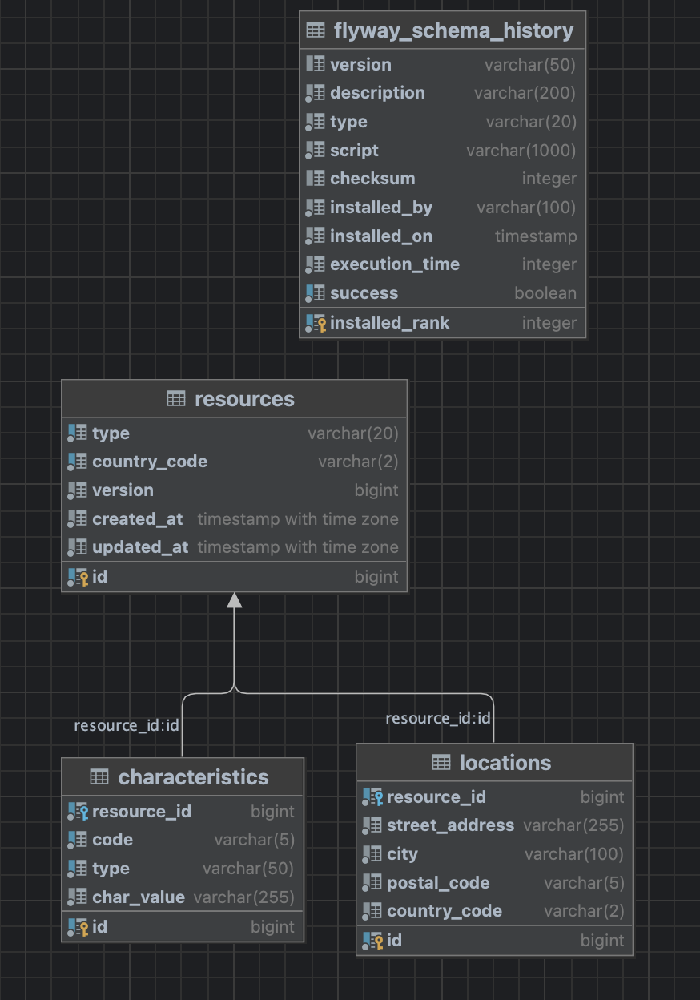

# Resource Management System

A Spring Boot 3 service for managing energy resources (metering points and connection points) with real-time Kafka event streaming and comprehensive validation.

## Quick Start

### Technology Stack
- **Java 21** with Spring Boot 3.5.5
- **PostgreSQL** with Spring Data JPA
- **Apache Kafka** with Spring Kafka
- **Flyway** for schema migrations
- **Docker** for containerization

### 1. Start the Application
```bash
# Start all services (app, database, kafka)
docker-compose up -d

# Wait for services to be ready
docker-compose ps

# To stop everything and clean up
docker-compose down --volumes --remove-orphans
```

### 2. Access the Application
- **API**: http://localhost:18080/api/v1/resources
- **Swagger UI**: http://localhost:18080/swagger-ui/index.html
- **Kafka UI**: http://localhost:18081
- **Health Check**: http://localhost:18080/actuator/health

**Recommended**: start with Swagger UI to explore and validate requests, then use curl for repeatable CLI tests.

## Main Features

### Resource Management
- **Resource Types**: METERING_POINT and CONNECTION_POINT
- **Locations**: Full address validation with ISO 3166-1 alpha-2 country codes
- **Characteristics**: Configurable key-value pairs with type validation
- **Optimistic Locking**: Prevents concurrent modification conflicts

### Event Streaming
- **Real-time Events**: All CRUD operations publish to Kafka
- **Event Types**: CREATED, UPDATED, DELETED, BATCH_NOTIFICATION

- **Resilience**: Producer retries with 10-minute timeout

### Validation & Error Handling
- **Bean Validation**: Comprehensive field validation with custom validators
- **Global Exception Handling**: Standardized error responses
- **Field-level Errors**: Detailed validation failure messages

## System Design

### Architecture
```
┌─────────────────┐    ┌──────────────┐    ┌─────────────────┐
│   REST API      │    │   Service    │    │   Database      │
│ (Controllers)   │───▶│   Layer      │───▶│ (PostgreSQL)    │
│                 │    │              │    │                 │
└─────────────────┘    └──────┬───────┘    └─────────────────┘
                              │
                              ▼
                       ┌──────────────┐
                       │    Kafka     │
                       │  Producer    │
                       └──────┬───────┘
                              ▼
                    ┌──────────────────────┐
                    │ Kafka Topics         │
                    │ • resource-updates   │
                    └──────────────────────┘
```

### Key Design Patterns
- Event-driven: all operations publish domain events
- Optimistic locking: version-based conflict resolution
- Global exception handling: consistent error responses
- Validation pipeline: layered request validation
- Resilient messaging: producer retries and timeouts

### API Design
- Base path: `/api/v1/resources` (resource-oriented, plural nouns)
- Content type: `application/json`
- Versioning: path version (`/v1`)
- Methods:
    - `POST /resources`: create a resource
    - `GET /resources`: list resources
    - `GET /resources/{id}`: fetch by id
    - `PUT /resources/{id}`: full replacement of a resource
    - `PATCH /resources/{id}`: partial update; unspecified fields remain unchanged
    - `DELETE /resources/{id}`: delete by id
- PATCH semantics:
    - Uses optional fields; only provided fields are applied
    - Providing `characteristics` replaces the entire set
    - Location countryCode is normalized to match the parent resource
- Concurrency: optimistic locking via `version` on the resource; conflicting writes return 409
- Errors: standardized problem shape with `status`, `error`, `message`, `path`, `timestamp`, and optional `fieldErrors`
- Discoverability: Swagger/OpenAPI available at `/swagger-ui/index.html`

### Event Design
#### Event Format
```json
{
  "eventType": "CREATED",
  "resourceId": 123,
  "resource": {
    "id": 123,
    "type": "METERING_POINT",
    "countryCode": "US",
    "version": 1,
    "createdAt": "2025-01-15T10:30:00Z",
    "updatedAt": "2025-01-15T10:30:00Z"
  },
  "eventTimestamp": "2025-01-15T10:30:00Z",
  "eventId": "550e8400-e29b-41d4-a716-446655440000"
}
```

#### Event Types
- CREATED: new resource created
- UPDATED: resource modified
- DELETED: resource removed
- BATCH_NOTIFICATION: all resources sent via `/send-all` endpoint

#### Kafka Topics
- Main topic: `resource-updates` (3 partitions)

#### Monitoring Events
```bash
# Watch events in real-time via Kafka UI
open http://localhost:18081

# Or via command line
docker-compose exec kafka kafka-console-consumer \
  --bootstrap-server localhost:9092 \
  --topic resource-updates \
  --from-beginning
```

### Database Schema



The diagram above shows the tables and relationships at a glance. Details follow.

#### resources
| Column       | Type         | Constraints/Notes |
|--------------|--------------|-------------------|
| id           | BIGSERIAL    | Primary key |
| type         | VARCHAR(20)  | NOT NULL, CHECK in ('METERING_POINT','CONNECTION_POINT') |
| country_code | VARCHAR(2)   | NOT NULL, CHECK regex '^[A-Z]{2}$' |
| version      | BIGINT       | NOT NULL, DEFAULT 0 (optimistic locking) |
| created_at   | TIMESTAMPTZ  | NOT NULL, DEFAULT CURRENT_TIMESTAMP |
| updated_at   | TIMESTAMPTZ  | NOT NULL, DEFAULT CURRENT_TIMESTAMP |

- Indexes: `idx_resource_country_code(country_code)`, `idx_resource_type(type)`

#### locations (1:1 with resources)
| Column        | Type         | Constraints/Notes |
|---------------|--------------|-------------------|
| id            | BIGSERIAL    | Primary key |
| resource_id   | BIGINT       | NOT NULL, FK → resources(id) ON DELETE CASCADE |
| street_address| VARCHAR(255) | NOT NULL |
| city          | VARCHAR(100) | NOT NULL |
| postal_code   | VARCHAR(5)   | NOT NULL, CHECK regex '^[0-9]{5}$' |
| country_code  | VARCHAR(2)   | NOT NULL, CHECK regex '^[A-Z]{2}$' |

- Constraints: `uq_location_resource UNIQUE(resource_id)` enforces one location per resource
- Note: country_code alignment with the parent resource is enforced at application level

#### characteristics (N:1 to resources)
| Column      | Type        | Constraints/Notes |
|-------------|-------------|-------------------|
| id          | BIGSERIAL   | Primary key |
| resource_id | BIGINT      | NOT NULL, FK → resources(id) ON DELETE CASCADE |
| code        | VARCHAR(5)  | NOT NULL |
| type        | VARCHAR(50) | NOT NULL, CHECK in ('CONSUMPTION_TYPE','CHARGING_POINT','CONNECTION_POINT_STATUS') |
| char_value  | VARCHAR(255)| NOT NULL |

- Indexes: `idx_characteristic_code(code)`, `idx_characteristic_type(type)`, `idx_characteristic_resource_id(resource_id)`

## API Reference

### Base URL
```
http://localhost:18080/api/v1/resources
```

### Core Operations

Notes
- Location is required and must include streetAddress, city, postalCode, and countryCode.
- Characteristics are optional; when provided, each item requires code, type, and value.

#### Create Resource
```bash
# Create Metering Point
curl -X POST http://localhost:18080/api/v1/resources \
  -H "Content-Type: application/json" \
  -d '{
    "type": "METERING_POINT",
    "countryCode": "US",
    "location": {
      "streetAddress": "123 Main St",
      "city": "New York",
      "postalCode": "10001",
      "countryCode": "US"
    },
    "characteristics": [{
      "code": "C001",
      "type": "CONSUMPTION_TYPE",
      "value": "RESIDENTIAL"
    }]
  }'

# Create Connection Point
curl -X POST http://localhost:18080/api/v1/resources \
  -H "Content-Type: application/json" \
  -d '{
    "type": "CONNECTION_POINT",
    "countryCode": "DE",
    "location": {
      "streetAddress": "456 Hauptstraße",
      "city": "Berlin",
      "postalCode": "10115",
      "countryCode": "DE"
    },
    "characteristics": [{
      "code": "CP01",
      "type": "CONNECTION_POINT_STATUS",
      "value": "ACTIVE"
    }]
  }'

# Create with Multiple Characteristics
curl -X POST http://localhost:18080/api/v1/resources \
  -H "Content-Type: application/json" \
  -d '{
    "type": "METERING_POINT",
    "countryCode": "CA",
    "location": {
      "streetAddress": "789 Maple Ave",
      "city": "Toronto",
      "postalCode": "12345",
      "countryCode": "CA"
    },
    "characteristics": [
      {
        "code": "C001",
        "type": "CONSUMPTION_TYPE",
        "value": "COMMERCIAL"
      },
      {
        "code": "CP02",
        "type": "CHARGING_POINT",
        "value": "FAST_CHARGING"
      }
    ]
  }'

```

#### Get Resources
```bash
# Get all resources
curl http://localhost:18080/api/v1/resources

# Get resource by ID
curl http://localhost:18080/api/v1/resources/{id}
```

#### Update Resource (PUT) - Full Replacement
```bash
# Complete resource update (replace {id} with actual resource ID)
curl -X PUT http://localhost:18080/api/v1/resources/{id} \
  -H "Content-Type: application/json" \
  -d '{
    "type": "METERING_POINT",
    "countryCode": "US",
    "location": {
      "streetAddress": "999 Updated Street",
      "city": "San Francisco",
      "postalCode": "94102",
      "countryCode": "US"
    },
    "characteristics": [{
      "code": "C002",
      "type": "CONSUMPTION_TYPE",
      "value": "INDUSTRIAL"
    }]
  }'
```

#### Update Resource (PATCH) - Partial Updates
```bash
# Change only country code (replace {id} with actual resource ID)
curl -X PATCH http://localhost:18080/api/v1/resources/{id} \
  -H "Content-Type: application/json" \
  -d '{
    "countryCode": "CA"
  }'

# Change resource type
curl -X PATCH http://localhost:18080/api/v1/resources/{id} \
  -H "Content-Type: application/json" \
  -d '{
    "type": "CONNECTION_POINT"
  }'

# Update location only
curl -X PATCH http://localhost:18080/api/v1/resources/{id} \
  -H "Content-Type: application/json" \
  -d '{
    "location": {
      "streetAddress": "555 New Address",
      "city": "Montreal",
      "postalCode": "54321",
      "countryCode": "CA"
    }
  }'

# Replace all characteristics
curl -X PATCH http://localhost:18080/api/v1/resources/{id} \
  -H "Content-Type: application/json" \
  -d '{
    "characteristics": [
      {
        "code": "NEW1",
        "type": "CONNECTION_POINT_STATUS",
        "value": "INACTIVE"
      },
      {
        "code": "NEW2",
        "type": "CHARGING_POINT",
        "value": "SLOW_CHARGING"
      }
    ]
  }'

# Multiple field update
curl -X PATCH http://localhost:18080/api/v1/resources/{id} \
  -H "Content-Type: application/json" \
  -d '{
    "type": "CONNECTION_POINT",
    "countryCode": "DE",
    "characteristics": [{
      "code": "CP03",
      "type": "CONNECTION_POINT_STATUS",
      "value": "MAINTENANCE"
    }]
  }'
```

#### Delete Resource
```bash
# Delete resource by ID (replace {id} with actual resource ID)
curl -X DELETE http://localhost:18080/api/v1/resources/{id}
```

#### Batch Operations
```bash
# Send all resources to Kafka
curl -X POST http://localhost:18080/api/v1/resources/send-all
```

### Response Formats

#### Resource Operations Response (GET, POST, PUT, PATCH)
```json
{
  "id": 123,
  "type": "METERING_POINT",
  "countryCode": "US",
  "version": 1,
  "createdAt": "2025-01-15T10:30:00Z",
  "updatedAt": "2025-01-15T10:30:00Z",
  "location": {
    "id": 456,
    "streetAddress": "123 Main St",
    "city": "New York",
    "postalCode": "10001",
    "countryCode": "US"
  },
  "characteristics": [{
    "id": 789,
    "code": "C001",
    "type": "CONSUMPTION_TYPE",
    "value": "RESIDENTIAL"
  }]
}
```

#### Get All Resources Response
```json
[
  {
    "id": 123,
    "type": "METERING_POINT",
    "countryCode": "US",
    "version": 1,
    "createdAt": "2025-01-15T10:30:00Z",
    "updatedAt": "2025-01-15T10:30:00Z",
    "location": {
      "id": 456,
      "streetAddress": "123 Main St",
      "city": "New York",
      "postalCode": "10001",
      "countryCode": "US"
    },
    "characteristics": [{
      "id": 789,
      "code": "C001",
      "type": "CONSUMPTION_TYPE",
      "value": "RESIDENTIAL"
    }]
  },
  {
    "id": 124,
    "type": "CONNECTION_POINT",
    "countryCode": "DE",
    "version": 2,
    "createdAt": "2025-01-15T11:00:00Z",
    "updatedAt": "2025-01-15T11:15:00Z",
    "location": {
      "id": 457,
      "streetAddress": "456 Hauptstraße",
      "city": "Berlin",
      "postalCode": "10115",
      "countryCode": "DE"
    },
    "characteristics": [{
      "id": 790,
      "code": "CP01",
      "type": "CONNECTION_POINT_STATUS",
      "value": "ACTIVE"
    }]
  }
]
```

#### Delete Resource Response
```
Status: 204 No Content
(Empty response body)
```

#### Send All Resources Response (Batch Operation)
```json
{
  "operationId": "550e8400-e29b-41d4-a716-446655440000",
  "resourceCount": 15,
  "status": "COMPLETED",
  "processedAt": "2025-01-15T10:30:00Z",
  "operation": "BATCH_NOTIFICATION"
}
```

Note: This is a simplified async dispatch. Status "COMPLETED" only reflects that dispatch was initiated, not downstream processing. A production-grade design should persist events using a transactional outbox and expose an operation tracker to reflect eventual success/failure.

### Error Response Formats

#### Validation Error Response (400)
```json
{
  "status": 400,
  "error": "Bad Request",
  "message": "Validation failed",
  "path": "/api/v1/resources",
  "timestamp": "2025-01-15T10:30:00Z",
  "fieldErrors": [
    {
      "field": "countryCode",
      "rejectedValue": "INVALID",
      "message": "Invalid country code 'INVALID'. Must be a valid ISO 3166-1 alpha-2 code"
    },
    {
      "field": "location.postalCode",
      "rejectedValue": "invalid",
      "message": "Postal code must be exactly 5 digits"
    }
  ]
}
```

#### JSON Parse Error (400)
```json
{
  "status": 400,
  "error": "Bad Request",
  "message": "JSON parse error: Unexpected end-of-input",
  "path": "/api/v1/resources",
  "timestamp": "2025-01-15T10:30:00Z",
  "fieldErrors": null
}
```

#### Invalid Enum Value (400)
```json
{
  "status": 400,
  "error": "Bad Request",
  "message": "Invalid enum value in request body",
  "path": "/api/v1/resources",
  "timestamp": "2025-01-15T10:30:00Z",
  "fieldErrors": null
}
```

#### Resource Not Found Error (404)
```json
{
  "status": 404,
  "error": "Not Found",
  "message": "Resource with ID 999 not found",
  "path": "/api/v1/resources/999",
  "timestamp": "2025-01-15T10:30:00Z",
  "fieldErrors": null
}
```

#### Method Not Allowed (405)
```json
{
  "status": 405,
  "error": "Method Not Allowed",
  "message": "Request method 'POST' is not supported",
  "path": "/api/v1/resources/1",
  "timestamp": "2025-01-15T10:30:00Z",
  "fieldErrors": null
}
```

#### Conflict (409) — Optimistic Locking
```json
{
  "status": 409,
  "error": "Conflict",
  "message": "Resource was modified by another transaction. Please refresh and try again.",
  "path": "/api/v1/resources/1",
  "timestamp": "2025-01-15T10:30:00Z",
  "fieldErrors": null
}
```

#### Conflict (409) — Data Integrity
```json
{
  "status": 409,
  "error": "Conflict",
  "message": "Data integrity constraint violation",
  "path": "/api/v1/resources",
  "timestamp": "2025-01-15T10:30:00Z",
  "fieldErrors": null
}
```

#### Unsupported Media Type (415)
```json
{
  "status": 415,
  "error": "Unsupported Media Type",
  "message": "Content type 'text/plain' not supported. Expected 'application/json'",
  "path": "/api/v1/resources",
  "timestamp": "2025-01-15T10:30:00Z",
  "fieldErrors": null
}
```

#### Server Error (500)
```json
{
  "status": 500,
  "error": "Internal Server Error",
  "message": "An unexpected error occurred",
  "path": "/api/v1/resources/send-all",
  "timestamp": "2025-01-15T10:30:00Z",
  "fieldErrors": null
}
```

 
## Testing

### Recommended Approach
- Start with Swagger UI for interactive exploration, schema visibility, and quick validation: open `http://localhost:18080/swagger-ui/index.html`.
- Then use curl for repeatable CLI tests and scripting once requests are clear.

### Automated Tests
```bash
# Run all unit tests (fast, isolated)
./mvnw test

# Coverage report (target: 85%+)
./mvnw test jacoco:report
open target/site/jacoco/index.html

# Specific test types
./mvnw -Dtest=ResourceServiceTest test          # Service layer
./mvnw -Dtest=ResourceControllerHappyPathTest test  # Controller
./mvnw -Dtest="*ValidationTest" test            # Validation
```
